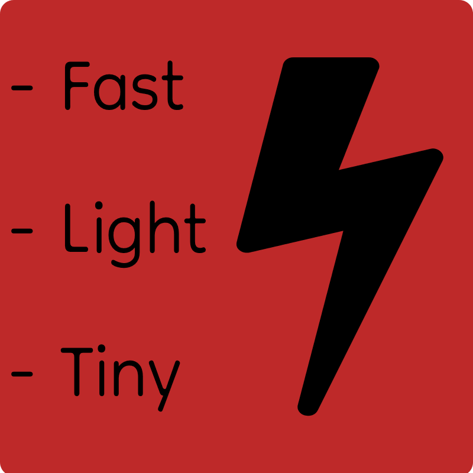

Minimal minecraft server software written in V

## Building

1. Download [V](https://vlang.io/)
2. Clone this repo
3. Run `v .` or `v -prod .` for a production build
4. Profit!

## License

[MIT-0](./LICENSE) <3
